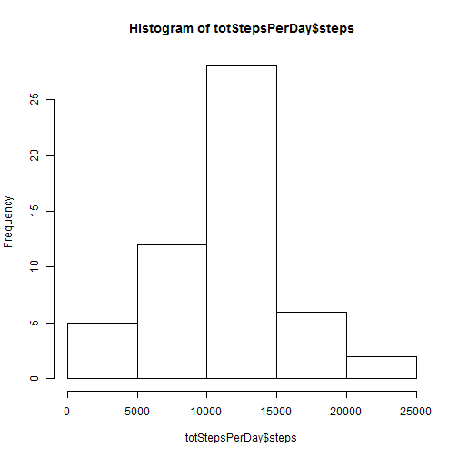
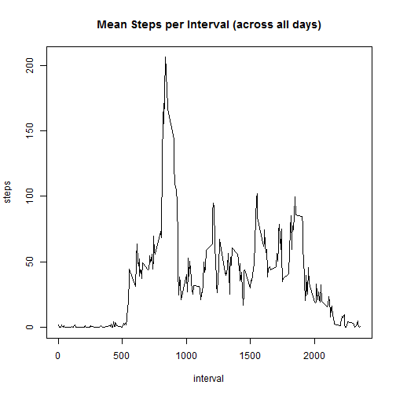
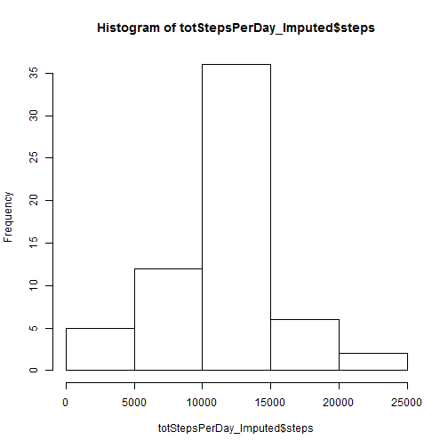
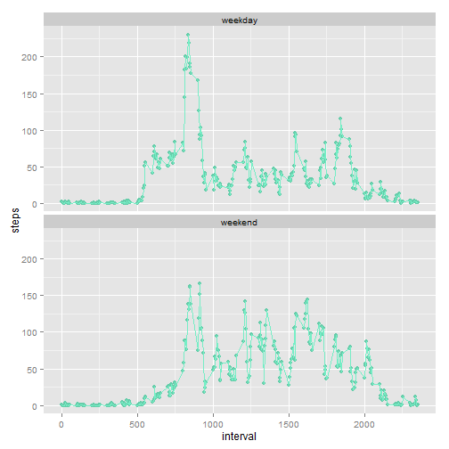

*Note: this document assumes that the R markdown file and the data are both in the 
working directory.*

## Load and process the data
Read in the data from the csv file into a variable called `act`.

```r
act <- read.csv("activity.csv", nrows = 18000)
```

## What is the mean total number of steps taken per day?
1. Calculate the total number of steps taken per day
2. Make a histogram of the total number of steps taken each day
3. Calculate and report the mean and median of the total number of steps taken per day
Note: I used `na.action = na.pass` rather than the default to omit NAs so that any days
which have NA values will still show up in the data frame with steps = NA. Inspection 
of the data set showed that we either have data for a whole day or we don't. There are 
no days with some data and some missing values.

```r
totStepsPerDay <- aggregate(steps ~ date, data = act, FUN = sum, na.action = na.pass)
hist(totStepsPerDay$steps)
```

 

```r
mean(totStepsPerDay$steps, na.rm = TRUE)
```

```
## [1] 10766.19
```

```r
median(totStepsPerDay$steps, na.rm = TRUE)
```

```
## [1] 10765
```

## What is the average daily activity pattern?
1. Make a time series plot (i.e. `type = "l"`) of the 5-minute interval (x-axis) and the 
average number of steps taken, averaged across all days (y-axis)
2. Which 5-minute interval, on average across all the days in the dataset, contains 
the maximum number of steps?

```r
avgStepsPerInterval <- aggregate(steps ~ interval, data = act, FUN = mean)
plot(avgStepsPerInterval, type = "l", main="Mean Steps per Interval (across all days)")
```

 

```r
avgStepsPerInterval[which.max(avgStepsPerInterval$steps),]
```

```
##     interval    steps
## 104      835 206.1698
```

## Imputing missing values
There are a number of days/intervals where there are missing values 
(coded as `NA`). The presence of missing days may introduce
bias into some calculations or summaries of the data.

1. Calculate and report the total number of missing values in the dataset (i.e. the total number of rows with `NA`s)
2. Devise a strategy for filling in all of the missing values in the dataset. The strategy does not need to be sophisticated. For example, you could use the mean/median for that day, or the mean for that 5-minute interval, etc.
3. Create a new dataset that is equal to the original dataset but with the missing data filled in.
4. Make a histogram of the total number of steps taken each day and Calculate and report the **mean** and **median** total number of steps taken per day. Do these values differ from the estimates from the first part of the assignment? What is the impact of imputing missing data on the estimates of the total daily number of steps?

My strategy: replace with the average for the interval. To do this, I give `avgStepsPerInterval` 
`row.names()`, force `act$interval` to character, subset `act` for missing data, and replace 
missing data with value in col 2 of named row in `avgStepsPerInterval`.

Replacing with the NAs with the mean will not change the mean. The median will change slightly.
The histgram should also change slightly as the total number of data points that can fall
into buckets has increased, and since all the points I added are the average number of steps, 
we should expect all the new data points to fall into the middle bucket.

```r
sum(rowSums(is.na(act) > 0)) #the logical tests if any row has NA rather than count all NAs
```

```
## [1] 2304
```

```r
act_Imputed <- act
missingSteps <- is.na(act_Imputed$steps)
row.names(avgStepsPerInterval) <- avgStepsPerInterval$interval
missingIntervals <- as.character(act_Imputed[missingSteps,3])
act_Imputed[missingSteps,1] = avgStepsPerInterval[missingIntervals,2]
totStepsPerDay_Imputed <- aggregate(steps ~ date, data = act_Imputed, FUN = sum)
hist(totStepsPerDay_Imputed$steps)
```

 

```r
mean(totStepsPerDay_Imputed$steps)
```

```
## [1] 10766.19
```

```r
median(totStepsPerDay_Imputed$steps)
```

```
## [1] 10766.19
```

## Weekdays vs Weekends
Use `act_Imputed` to:
1. Create a new factor variable in the dataset with two levels -- "weekday" and "weekend" indicating whether a given date is a weekday or weekend day.
2. Make a panel plot containing a time series plot (i.e. `type = "l"`) of the 5-minute interval (x-axis) and the average number of steps taken, averaged across all weekday days or weekend days (y-axis). The plot should look something like the following, which was created using **simulated data**:

```r
wkdys <- weekdays(as.Date(act_Imputed$date))
wkdys[wkdys %in% c("Monday", "Tuesday", "Wednesday", "Thursday", "Friday")] <- "weekday"
wkdys[wkdys %in% c("Saturday", "Sunday")] <- "weekend"
act_Imputed$WeekPart <- wkdys
dayVsEnd <- aggregate(steps ~ interval + WeekPart, data = act_Imputed, FUN = mean)

library(ggplot2)
ggplot(dayVsEnd, aes(interval, steps)) +
  geom_point(color="aquamarine3") +
  geom_line(color="aquamarine2") +
  facet_wrap(~WeekPart, nrow=2)
```

 
